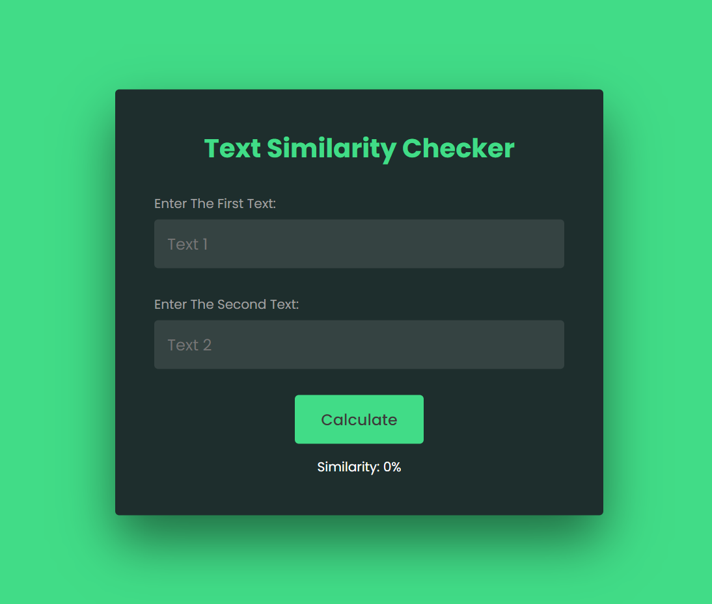

# Text Similarity Checker

This repository hosts a Text Similarity Checker, a JavaScript project designed to compare two text inputs and determine their similarity percentage. The project is built using HTML, CSS, and JavaScript, featuring a modern UI design for user-friendly interaction.

## Preview



## Features

- **Text Comparison:** Compare two text inputs to identify similarities.
- **Percentage Indicator:** Display the similarity percentage between the texts.
- **Modern UI Design:** Sleek and responsive design for an enhanced user experience.

## Getting Started

To use this Text Similarity Checker in your project, follow these steps:

1. Clone the repository to your local machine:

   ```bash
   git clone https://github.com/Devsethi3/Text-Similarity-Checker.git
   ```

2. Open the `index.html` file in your preferred web browser.

## Usage

1. Enter two text strings in the provided input fields.
2. Click the "Check Similarity" button.
3. The project will analyze the texts and display the similarity percentage.

## Customization

Feel free to customize the project to fit your requirements. Adjust the styles, colors, and layout as needed. You can also extend the functionality to include more advanced text comparison features.

## Contributing

If you'd like to contribute to this project, please follow these steps:

1. Fork the repository.
2. Create a new branch for your feature or improvement.
3. Make your changes and commit them with descriptive messages.
4. Push your changes to your forked repository.
5. Open a pull request to merge your changes into the main branch.

Explore the Text Similarity Checker, provide feedback, and consider contributing to its development. Thank you for checking out the JavaScript Text Similarity Checker repository!